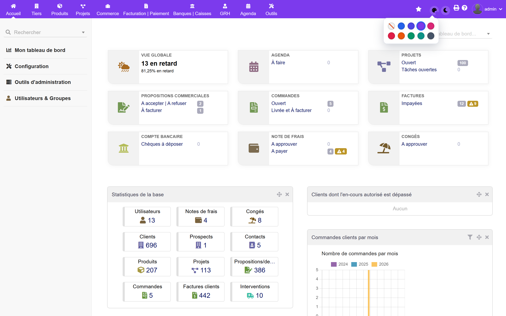
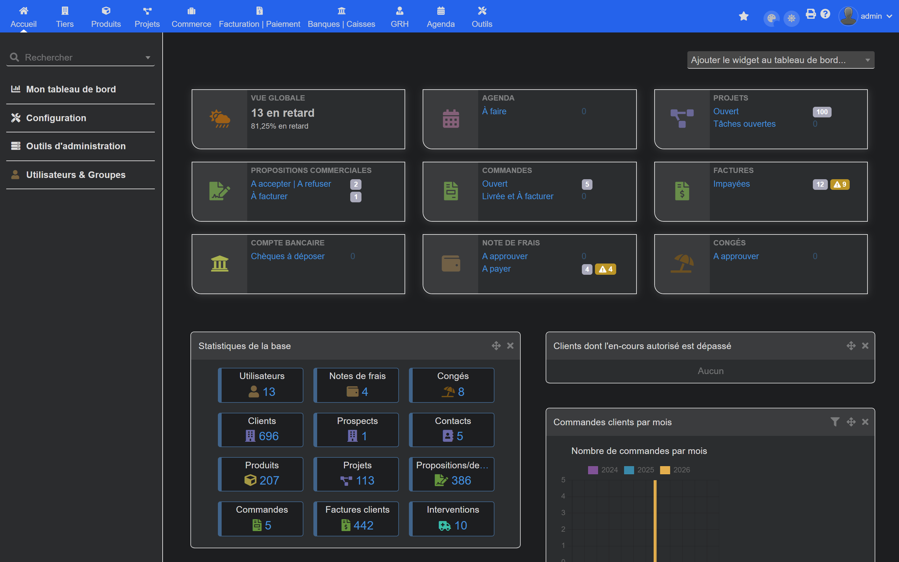
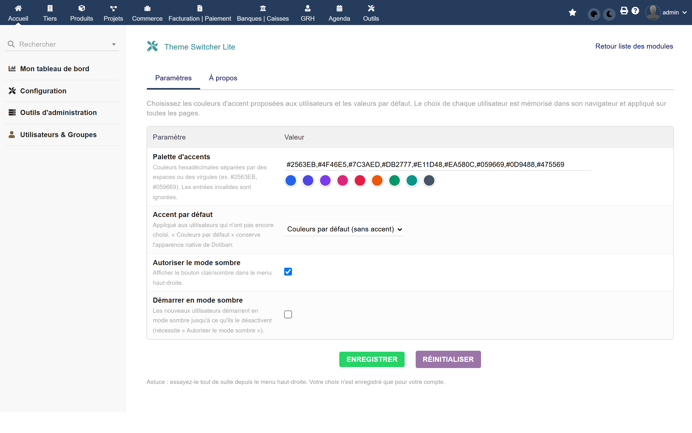

# Theme Switcher Lite — Dolibarr module

> **A splash of colour, and a dark mode, in one click.** Theme Switcher Lite adds a
> small control to Dolibarr's top-right menu so every user can pick an accent colour
> and toggle light/dark — remembered per user, applied everywhere. Free & open-source,
> no database table, no data entry.

[](https://www.gnu.org/licenses/gpl-3.0)


A free module by **[DoliResources](https://www.doliresources.com)** · Live demo: **[demo.doliresources.com](https://demo.doliresources.com)**

---

## Why?

Not everyone wants the same Dolibarr. Some people want their brand colour on the top
bar; others just want dark mode for late-night invoicing. Theme Switcher Lite gives
each user that choice without an admin editing theme constants — and without replacing
the theme. It reuses Dolibarr's own colour variables and native dark palette, so it
stays consistent and update-proof.

## Features

- 🎨 **Accent-colour picker** in the top-right menu, from a palette you define.
- 🌙 **One-click light / dark mode**, reusing Dolibarr's native dark palette.
- 👤 **Remembered per user** in the browser (localStorage) — applied on every page, with no colour flash.
- ⚙️ **Admin controls**: palette, default accent, allow dark mode, start-in-dark.
- 🌍 **5 languages**: English, French, German, Spanish, Italian.
- 🪶 **Zero footprint**: no SQL table, no data entry, negligible overhead. It is *not* a full theme replacement.

## Screenshots

| Accent colours (light) | Dark mode | Setup |
|---|---|---|
|  |  |  |

## How it works

Each choice is stored in the browser (`localStorage`) and re-applied before the page
paints, so there is no flash. The **accent** remaps two of Dolibarr's own CSS colour
variables (top menu bar + primary buttons), and **dark mode** applies Dolibarr's native
dark palette scoped to the current user — so nothing is hard-coded and the look stays
consistent across updates. Nothing is written to the database.

## Installation

**From the ZIP (recommended)**

1. Download the latest `module_themeswitcherlite-x.y.z.zip` from the [Releases](../../releases) page.
2. In Dolibarr: **Home → Setup → Modules → Deploy/install external module**, upload the ZIP.
3. Enable **Theme Switcher Lite** in the module list (tab *Interfaces with external systems*).
4. Hard-refresh once (Ctrl + Shift + R) so the CSS/JS load.

**From source**

```bash
cd dolibarr/htdocs/custom      # your Dolibarr "custom" directory
git clone https://github.com/DoliResources/themeswitcherlite.git
```

Then enable the module in **Home → Setup → Modules**.

## Configuration

**Home → Setup → Modules → Theme Switcher Lite → Settings**

| Setting | Default | Description |
|---|---|---|
| Accent palette | 9 curated colours | Space/comma separated hex colours offered to users. |
| Default accent | *(none)* | Applied to users who have not chosen one. Empty = native colours. |
| Allow dark mode | on | Show the light/dark toggle. |
| Start in dark mode | off | New users start dark until they toggle off. |

Then just use the control in the **top-right menu** — every account keeps its own choice.

## Compatibility

- Compatible with Dolibarr (eldy theme; interface module, no schema changes).
- PHP **7.0+**.

## License

Released under the **GNU General Public License v3.0** — see [LICENSE](LICENSE).
© 2026 [DoliResources](https://www.doliresources.com).

## About DoliResources

We build practical, well-crafted modules and themes for Dolibarr ERP/CRM.
Discover more on **[doliresources.com](https://www.doliresources.com)** and try our
modules live on **[demo.doliresources.com](https://demo.doliresources.com)**.
